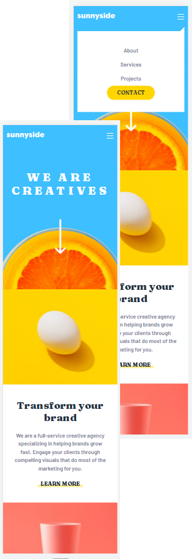
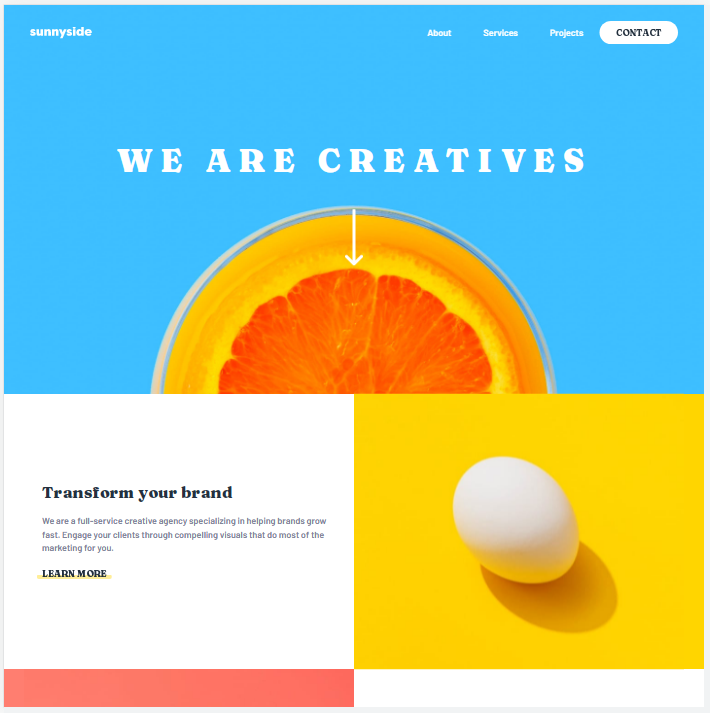

# Frontend Mentor - Sunnyside agency landing page solution

This is a solution to the [Sunnyside agency landing page challenge on Frontend Mentor](https://www.frontendmentor.io/challenges/sunnyside-agency-landing-page-7yVs3B6ef). Frontend Mentor challenges help you improve your coding skills by building realistic projects.

## Table of contents

- [Overview](#overview)
  - [The challenge](#the-challenge)
  - [Screenshot](#screenshot)
  - [Links](#links)
- [My process](#my-process)
  - [Built with](#built-with)
  - [Continued development](#continued-development)

## Overview

### The challenge

Users should be able to:

- View the optimal layout for the site depending on their device's screen size
- See hover states for all interactive elements on the page

### Screenshot

\

### Links

- Solution URL: [Github Repo](git@github.com:bague-rodnel/sunnyside-agency.git)
- Live Site URL: [Github Pages](https://bague-rodnel.github.io/sunnyside-agency/)

## My process

This was coded with Bootstrap 5.1.3. Only the necessary compiled css files have been linked to. The js is fetched via cdn.

### Built with

- Semantic HTML5 markup
- Bootstrap
- Mobile-first workflow

### Continued development

I felt like this took longer than expected considering I was using Bootstrap. I'm going to redo this with pure css for a change in another branch
